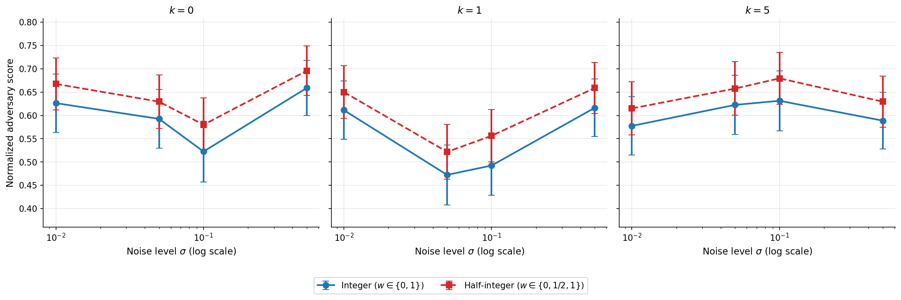

# Learnable Obfuscation for Temporally Related Video Data



## Setup

### 1. Create a conda environment

```
conda create -n security python=3.11
conda activate security
```

### 2. Install PyTorch with CUDA

Follow https://pytorch.org/get-started/locally/ for the right command for your platform. For example:

```
pip3 install torch torchvision --index-url https://download.pytorch.org/whl/cu130
```

If you don't have a GPU, install `torch` and `torchvision` normally.

### 3. Install remaining dependencies

```
pip3 install -r requirements.txt
```

## Running the pipeline

Run the two scripts in this order:

```
bash run_mia.sh
bash run_accuracy.sh --wait
```

- `run_mia.sh` runs the membership-inference attack across `k = 0, 1, 5`, merges the per-cell results, and produces **Figure 2** and **Figure 3**.
- `run_accuracy.sh --wait` runs the accuracy sweep across `k * sigma`, merges the per-cell results, and produces **Figure 4**. (Without `--wait` it launches jobs in the background and you must run `src/merge_accuracy.py` and `src/figure4_pareto.py` yourself once they finish.)

**Figure 1** is a standalone analytical plot and can be generated at any time:

```
python src/figure1_prior_success.py
```
